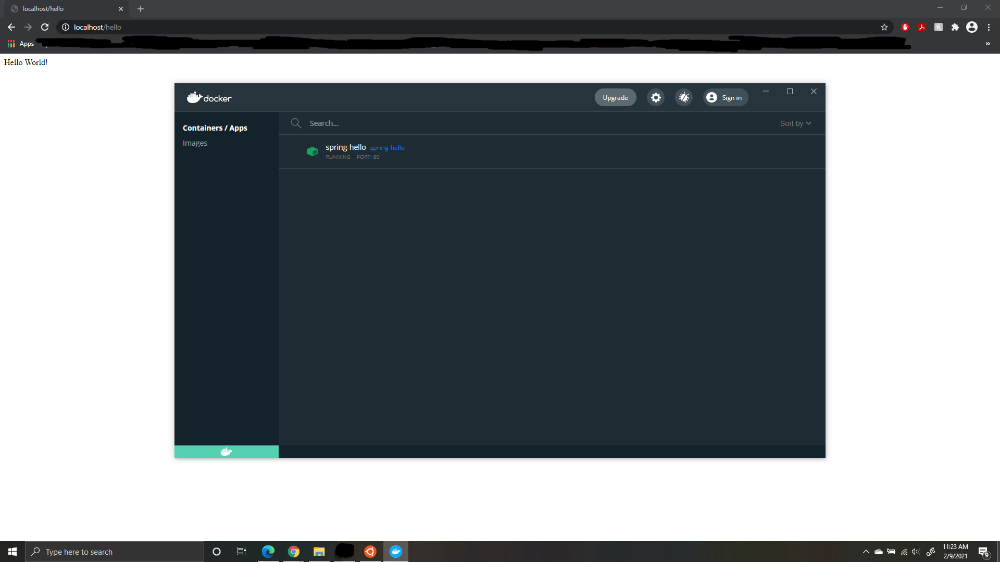
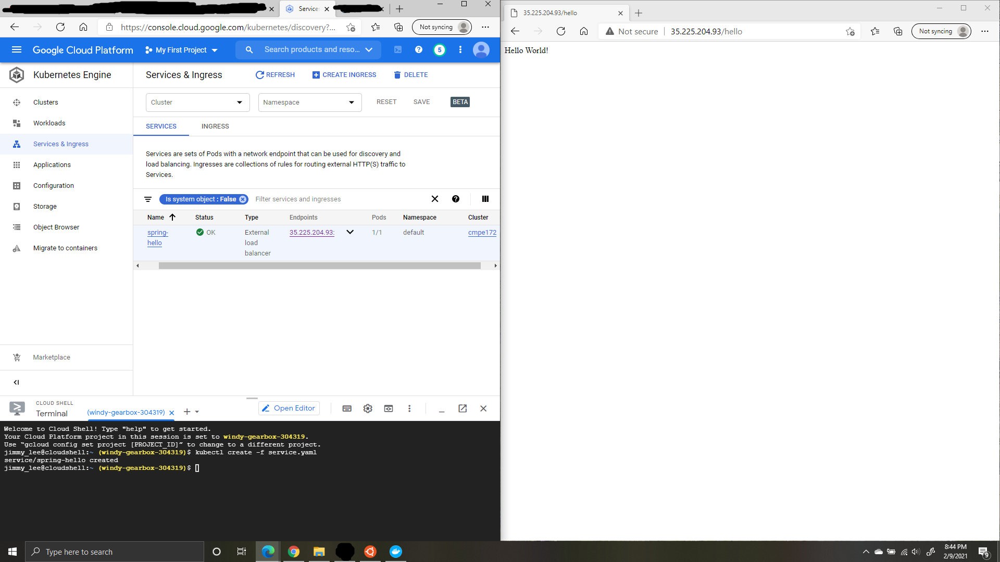
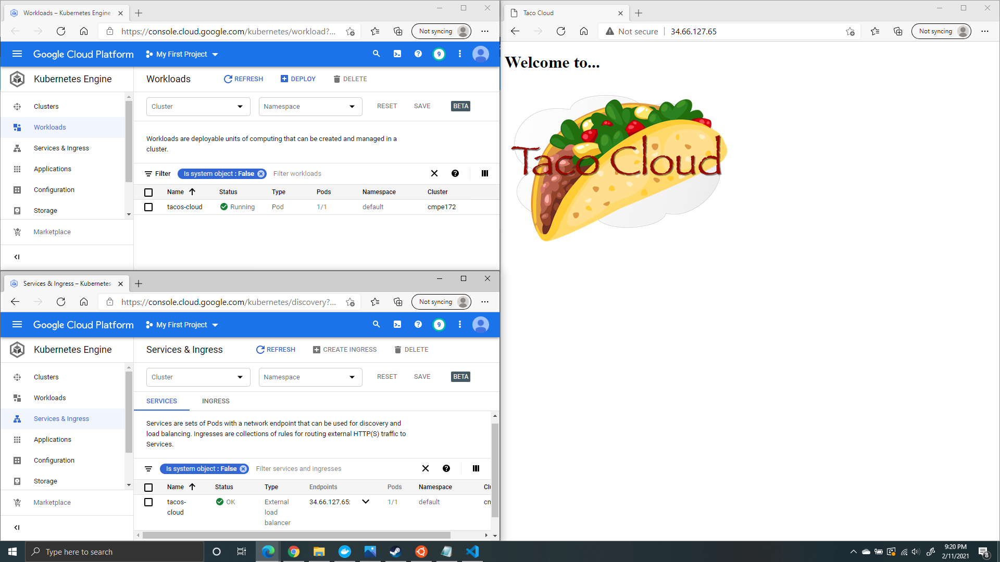

# CMPE 172 - Lab #1 Notes
The objective of this lab is to familiarize ourselves with the Spring Demo app, Docker, and Google Cloud. We will be building multiple Spring Boot Projects using different Spring Tools.

# Table of Contents
[Pre-Lab Installations](#pre-lab-installations)

[Part 1 - Spring Demo App](#part-1---spring-demo-app)

[Part 1.1 - Spring Demo App Using Spring Initializer](#part-11---spring-demo-app-using-spring-initializer)

[Part 1.2 - Spring Demo App Using Spring Tools in Visual Studio Code](#part-12---spring-demo-app-using-spring-tools-in-visual-studio-code)

[Part 1.3 - Spring Demo App Configured for Docker and Kubernettes](#part-13---spring-demo-app-configured-for-docker-and-kubernettes)

[Part 2 - Spring Tacos Cloud App](#part-2---spring-tacos-cloud-app)

# Pre-Lab Installations
In order to complete the lab, we were required to download the following:
https://www.docker.com/products/docker-desktop
https://code.visualstudio.com
https://marketplace.visualstudio.com/items?itemName=Pivotal.vscode-boot-dev-pack
https://sdkman.io
https://adoptopenjdk.net
https://gradle.org/install
Ubuntu 20.04 was also installed since the lab required WSL2 instead of WSL1 to function. It was found that Ubuntu and Ubuntu 18.04 did not support WSL2.

We were also required to create an account in the following to get access to its resources.
https://cloud.google.com/free
https://hub.docker.com

# Part 1 - Spring Demo App

# Part 1.1 - Spring Demo App Using Spring Initializer
We generated a Spring Boot Project using https://start.spring.io/ using the following parameters.
Project: Gradle Project
Language: Java Language (JDK 11)
Spring Boot Version: 2.4.2
Group: com.example
Artifact: demo-initializr
Name: demo-initializr
Package Name: come.example.demo-initializr
Packaging: Jar
Dependencies: Spring Web

The zip file was extracted and the java file was modified to match the name of the generated code.

The Spring Demo App was run on the local machine with the message: Hello CMPE 172! 

# Part 1.2 - Spring Demo App Using Spring Tools in Visual Studio Code
We generated a Spring Boot Project using https://start.spring.io/ using the following parameters.
Project: Gradle Project
Language: Java Language (JDK 11)
Spring Boot Version: 2.4.2
Group: com.example
Artifact: demo-vscode
Name: demo-vscode
Package Name: come.example.demo-vscode
Packaging: Jar
Dependencies: Spring Web

The zip file was extracted and the java file was modified to match the name of the generated code.

The Spring Demo App was run from Visual Studios Code in debug mode with the message: Hello CMPE 172! 

# Part 1.3 - Spring Demo App Configured for Docker and Kubernettes
We generated a Spring Boot Project using https://start.spring.io/ using the following parameters.
Project: Gradle Project
Language: Java Language (JDK 11)
Spring Boot Version: 2.4.2
Group: com.example
Artifact: demo-docker
Name: demo-docker
Package Name: come.example.demo-docker
Packaging: Jar
Dependencies: Spring Web

The zip file was extracted and the java file was modified to match the name of the generated code.

The following was done using Ubuntu:
make docker-build
make docker-push account=

We added the following files from Paul Nguyen's github: https://github.com/paulnguyen/cmpe172/tree/main/labs/lab1/docker
Dockerfile
Makefile
pod.yaml
service.yaml

In Google Cloud, we created a cluster and connected it with the terminal. We added the pod.yaml and service.yaml files in the editor and ran the following functions:
kubectl apply -f pod.yaml
kubectl create -f service.yaml

# Part 2 - Spring Tacos Cloud App
We extracted the zip file for the Taco Spring Boot Project.

We added and edited the following files from Paul Nguyen's github: https://github.com/paulnguyen/cmpe172/tree/main/labs/lab1/docker
Dockerfile
Makefile
pod.yaml
service.yaml

The following was done using Ubuntu:
make docker-build
make docker-push account=

In Google Cloud, we created a cluster and connected it with the terminal. We added the pod.yaml and service.yaml files in the editor and ran the following functions:
kubectl apply -f pod.yaml
kubectl create -f service.yaml

