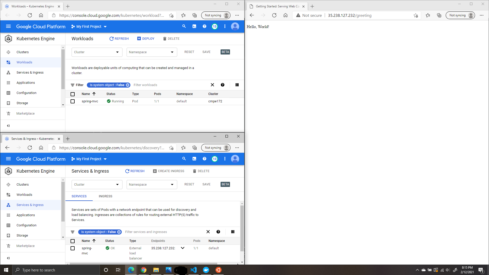
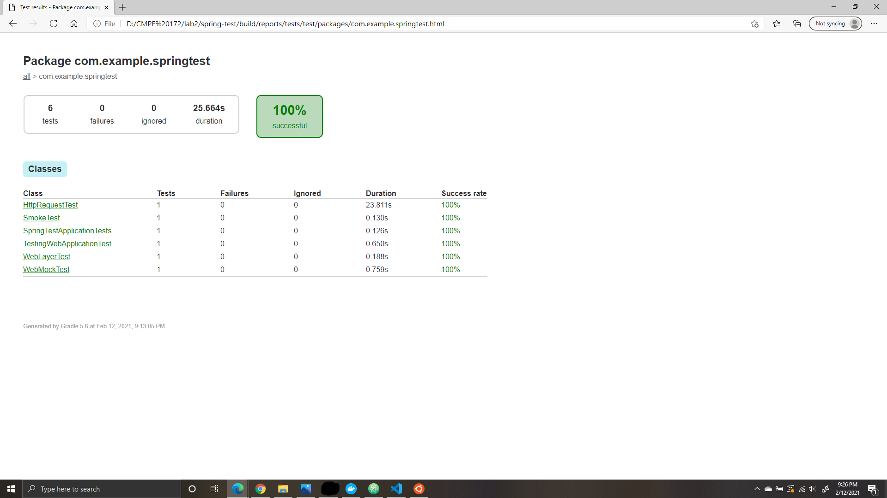
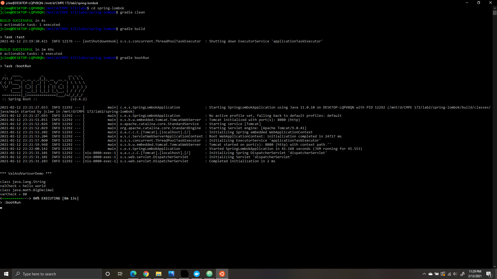
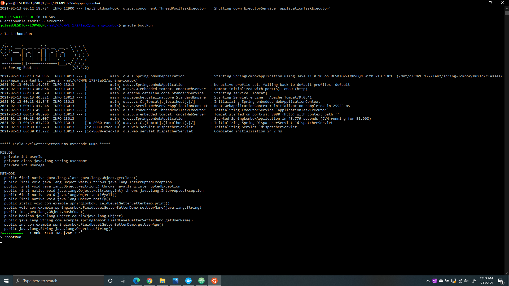
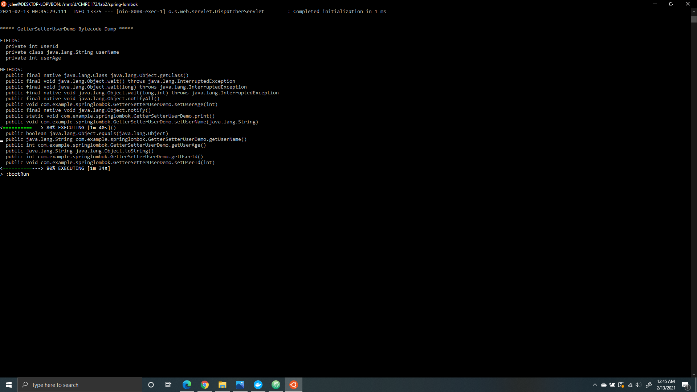
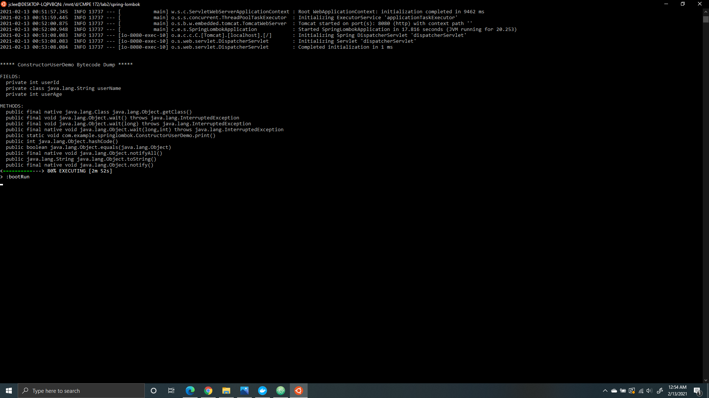
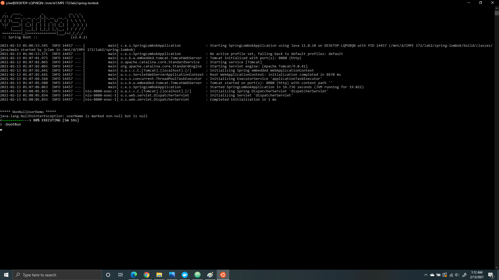
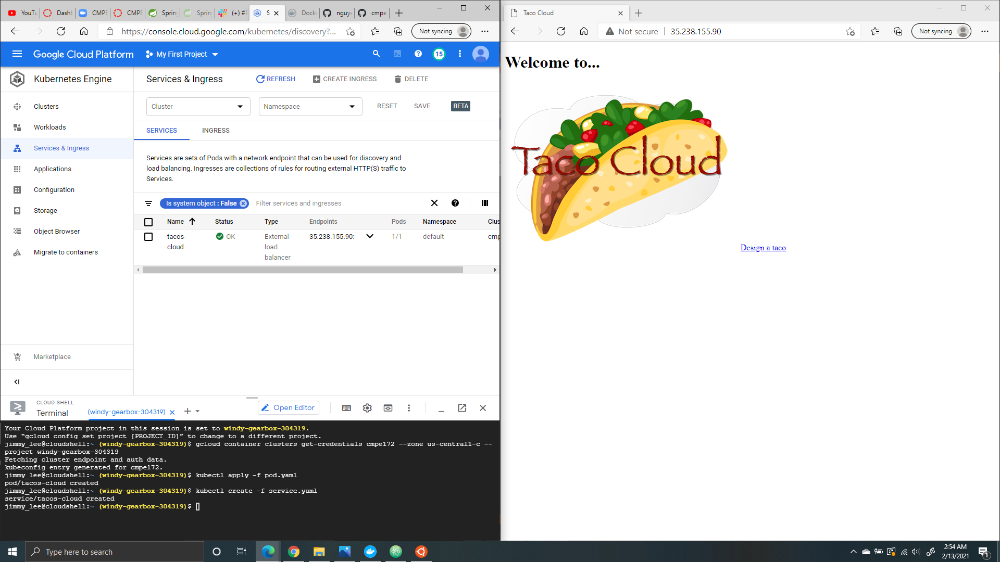
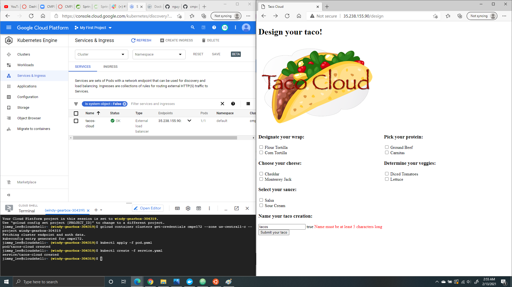
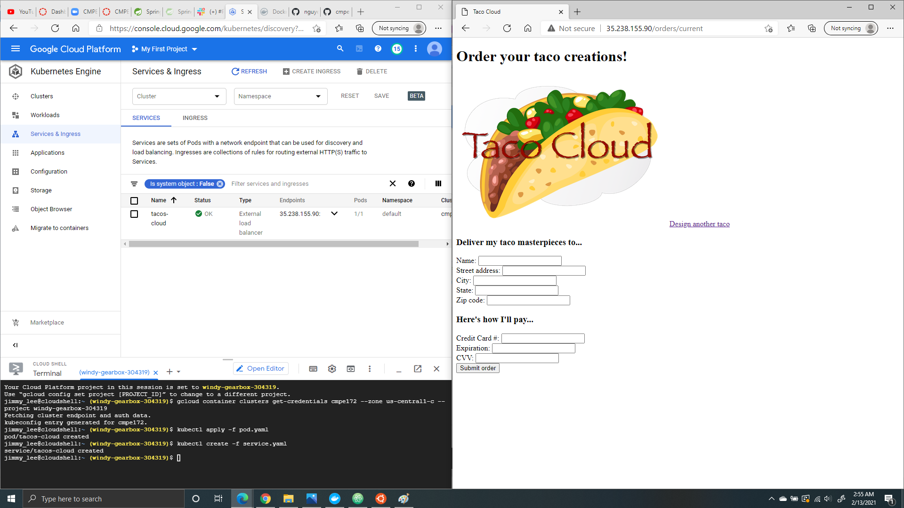

# CMPE 172 - Lab #2 Notes
In this lab, we will be familiarizing ourselves with Spring MVC and Spring Testing on Docker and Google Cloud.

# Tables of Content
[Spring MVC](#part-11---spring-mvc)

[Spring Testing](#part-12---spring-testing)

[Spring Lombok](#part-2---spring-lombok)

[Tacos Cloud App (Version 2)](#part-3---tacos-cloud-app-version-2)

# Part 1.1 - Spring MVC
We generated a Spring Boot Project using https://start.spring.io/ using the following parameters.
Project: Gradle Project
Language: Java Language (JDK 11)
Spring Boot Version: 2.4.2
Group: com.example
Artifact: spring-mvc
Name: spring-mvc
Package Name: come.example.spring-mvc
Packaging: Jar
Dependencies: Spring Web, Thymeleaf, Spring Boot DevTools, Testcontainers

We added a GreetingController.java file and a greeting.html file.

The following was done using Ubuntu:
make docker-build
make docker-push account=

We added the following files from Paul Nguyen's github: https://github.com/paulnguyen/cmpe172/tree/main/labs/lab1/docker
Dockerfile
Makefile
pod.yaml
service.yaml

In Google Cloud, we created a cluster and connected it with the terminal. We added the pod.yaml and service.yaml files in the editor and ran the following functions:
kubectl apply -f pod.yaml
kubectl create -f service.yaml

# Part 1.2 - Spring Testing
We generated a Spring Boot Project using https://start.spring.io/ using the following parameters.
Project: Gradle Project
Language: Java Language (JDK 11)
Spring Boot Version: 2.4.2
Group: com.example
Artifact: spring-test
Name: spring-test
Package Name: come.example.spring-test
Packaging: Jar
Dependencies: Spring Web, Thymeleaf, Spring Boot DevTools, Testcontainers

We added the following files to the project:
Home Controller.java
SmokeTest.java
HTTPRequestTest.java
TestingWebApplicationTest.java
WebLayerTest.java
GreetingController.java
WebMockTest.java

We ran the Spring App Tests:

# Part 2 - Spring Lombok
We generated a Spring Boot Project using https://start.spring.io/ using the following parameters.
Project: Gradle Project
Language: Java Language (JDK 11)
Spring Boot Version: 2.4.2
Group: com.example
Artifact: spring-lombok
Name: spring-lombok
Package Name: come.example.spring-lombok
Packaging: Jar
Dependencies: Spring Web, Validation, Lombok

We added the following files to the project:
ValAndVarUserDemo.java
FieldLevelGetterSetterDemo.java
GetterSetterUserDemo.java
ConstructorUserDemo.java
DataUserDemo.java
NonNullUserDemo.java

We edited the following file:
SpringLombokApplication.java

We ran each and every test individually.
ValAndVarUserDemo.java - This test gives the variable a class and a value. The output returns a strong class and returns the java.math.BigDecial class.

FieldLevelGetterSetterDemo.java - This test contains the getter method for userName and userAge as well as the setter method for userName. The output would show the setUsername(), getUsername(), and getUserAge().

GetterSetterUserDemo.java - This test contains the getter and setter methods for userId, userName, and userAge. The output shows the getter and setter methods for each variable. 

ConstructorUserDemo.java - This test generates a constructor with no parameters and one with a parameter for each field. 

NonNullUserDemo.java -  This test checks if the userName is null. If it isn't then it throws a NullPointerException. The output shows a NullPointerException being thrown.

# Part 3 - Tacos Cloud App (Version 2)
We copied over the tacos-cloud file from Lab 1.

We imported the following files from https://github.com/habuma/spring-in-action-5-samples/tree/master/ch02/tacos
Ingredient.java
Order.java
Taco.java
DesignTacoController.java
OrderController.java
WebConfig.java
design.html
home.html
orderForm.html
styles.css

We deleted the test files from tacos-cloud.

We added the Validation and Lombok dependencies to the project.

The following was done using Ubuntu:
make docker-build
make docker-push account=

In Google Cloud, we created a cluster and connected it with the terminal. We added the pod.yaml and service.yaml files in the editor and ran the following functions:
kubectl apply -f pod.yaml
kubectl create -f service.yaml

