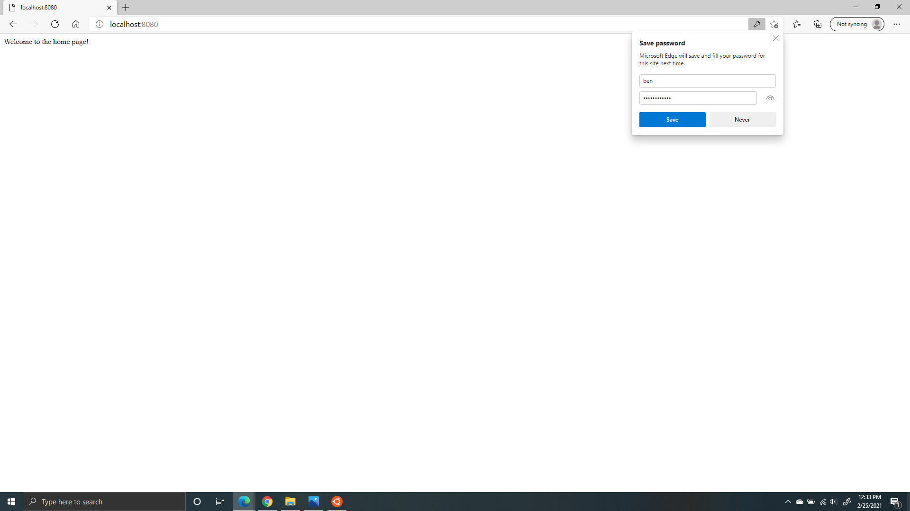
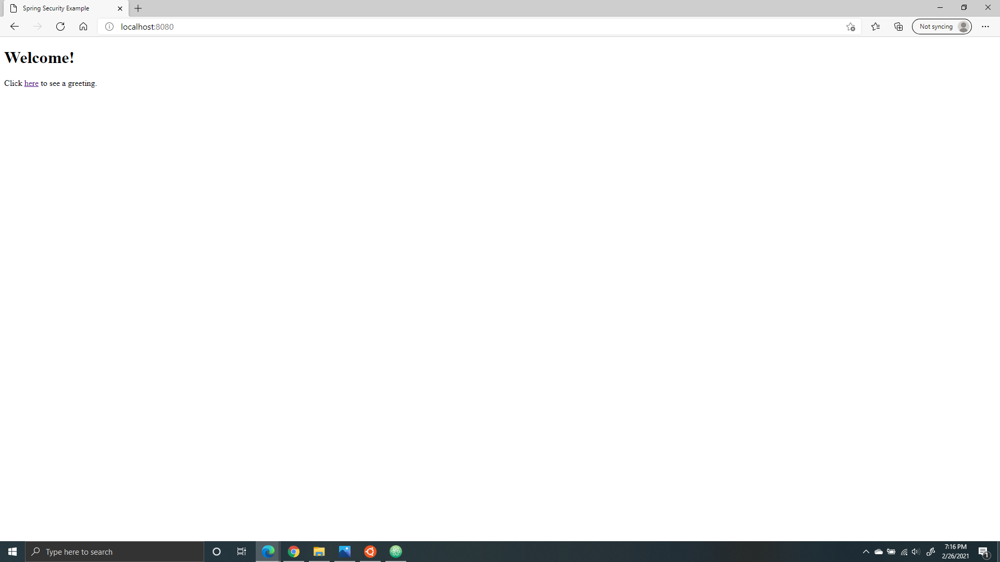
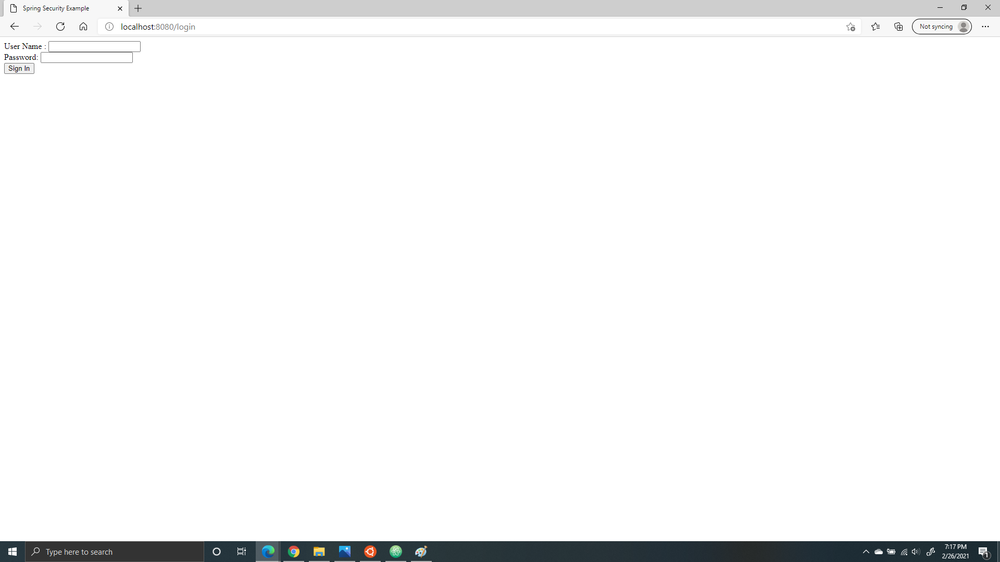
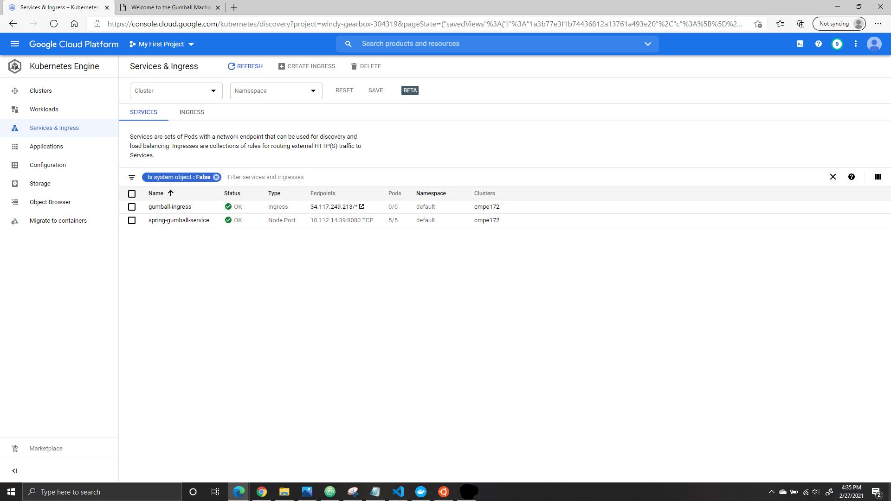
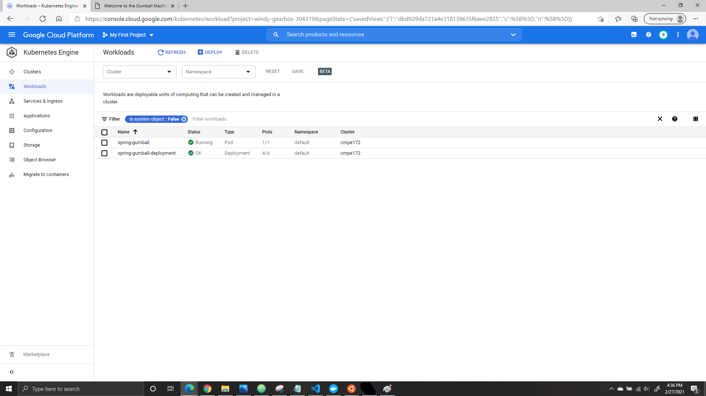

# CMPE 172 - Lab #4 Notes
In this lab, we will be 

# Table of Contents
[Spring LDAP](#spring-ldap)
[Spring Security](#spring-security)
[Spring Gumball Version 2](#spring-gumball-v2)

# Spring LDAP
We generated a Spring Boot Project using https://start.spring.io/ using the following parameters.
* Project: Gradle Project
* Language: Java Language (JDK 11)
* Spring Boot Version: 2.4.2
* Group: com.example
* Artifact: spring-ldap
* Name: spring-ldap
* Package Name: come.example.spring-ldap
* Packaging: Jar
* Dependencies: Spring Web, Spring Security, Spring LDAP, Embedded LDAP Server

We added the following files:
* HomeController.java
* WebSecurityConfig.java
* test-server.ldif

We modified the following files:
* build.gradle
* application.properties
* SpringLdapApplicationTests.java

We were able to log in using a predefined account. Username: Ben Password: Benspassword

# Spring Security
We generated a Spring Boot Project using https://start.spring.io/ using the following parameters.
* Project: Gradle Project
* Language: Java Language (JDK 11)
* Spring Boot Version: 2.4.2
* Group: com.example
* Artifact: spring-security
* Name: spring-security
* Package Name: come.example.spring-security
* Packaging: Jar
* Dependencies: Spring Web, Thymeleaf, Spring Security

We added the following files:
* home.html
* hello.html
* MvcConfig.java
* WebSecurityConfig.java
* login.html

Here is the home page:

Here is the login page:

After logging in, there's a sign out button:

# Spring Gumball V2
We copied the Spring Boot Project from https://github.com/paulnguyen/cmpe172/tree/main/spring/spring-gumball-v2.

We added the following files:
* GumballMachine.java
* gumball.html
* GumballCommand.java

We modified the files to get rid of the session ID. We added a function to hash the state & timestamp and print it out on the bottom left hand corner of the page. 

The following commands were ran in Ubuntu:
* make docker-build
* make docker-push account=

In Google Cloud, we created a cluster and connected it with the terminal. We added the following files to the editor:
* pod.yaml
* service.yaml
* deployment.yaml

We ran the following commands in the terminal:
* kubectl create -f deployment.yaml
* kubectl create -f service.yaml
* kubectl create -f pod.yaml

We created a ingress file. Below is the service and ingress:

Below is the deployment and pod:

With Spring Gumball Version 2, we are no longer using session ID. In Version 1, we had an issue of running into an error page whenever we inserted a quarter. With Version 2, we no longer see that error page when we attempt to input a quarter.
