# CMPE 172 - Lab #5 Notes

# Spring JDBC
We generated a Spring Boot Project using https://start.spring.io/ using the following parameters.
* Project: Gradle Project
* Language: Java Language (JDK 11)
* Spring Boot Version: 2.4.3
* Group: com.example
* Artifact: spring-jdbc
* Name: spring-jdbc
* Package Name: come.example.spring-jdbc
* Packaging: Jar
* Dependencies: Spring Web, Spring LDAP

We added the following files:
* Customer.java
* SpringJdbcApplication.java

We ran the following functions in Ubuntu:
* gradle build
* gradle bootRun

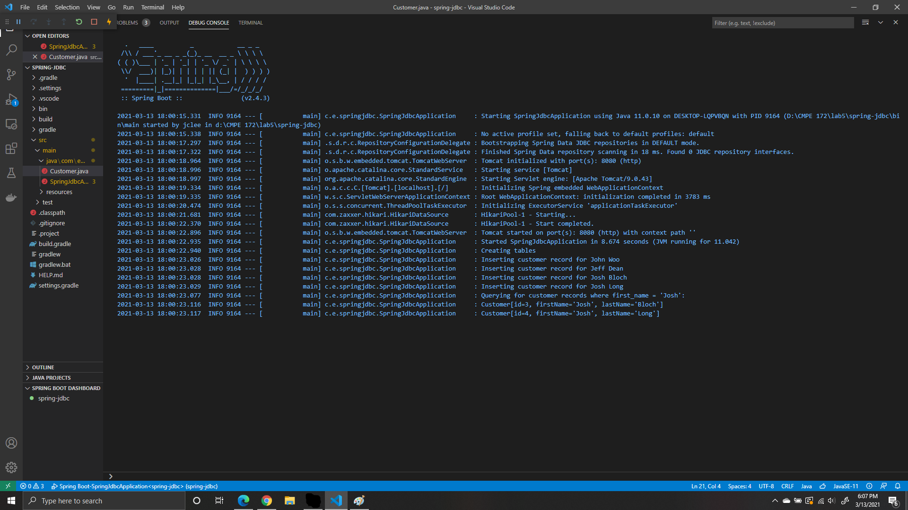

In the Ubuntu, you can see the customers being inputted into the table.

# Spring MySQL
We generated a Spring Boot Project using https://start.spring.io/ using the following parameters.
* Project: Gradle Project
* Language: Java Language (JDK 11)
* Spring Boot Version: 2.4.3
* Group: com.example
* Artifact: spring-mysql
* Name: spring-mysql
* Package Name: come.example.spring-mysql
* Packaging: Jar
* Dependencies: Spring Web, Spring JPA, MYSQL Driver

We added/edited the following files:
* application.properties
* User.java
* UserRepository.java
* MainController.java

We ran the following functions in Ubuntu:
* docker run -d --name mysql -td -p 3306:3306 -e MYSQL_ROOT_PASSWORD=cmpe172 mysql:8.0
* docker exec -it mysql bash
* mysql --password
* mysql> create database db_example; -- Creates the new database
* mysql> create user 'springuser'@'%' identified by 'ThePassword'; -- Creates the user
* mysql> grant all on db_example.* to 'springuser'@'%'; -- Gives all privileges to the new user on the newly created database

Using the terminal in Visual Studios, the following functions were ran:
* curl localhost:8080/demo/add -d name=First -d email=someemail@someemailprovider.com
* curl 'localhost:8080/demo/all'

I ran into an issue where it wouldn't connect to port 8080.

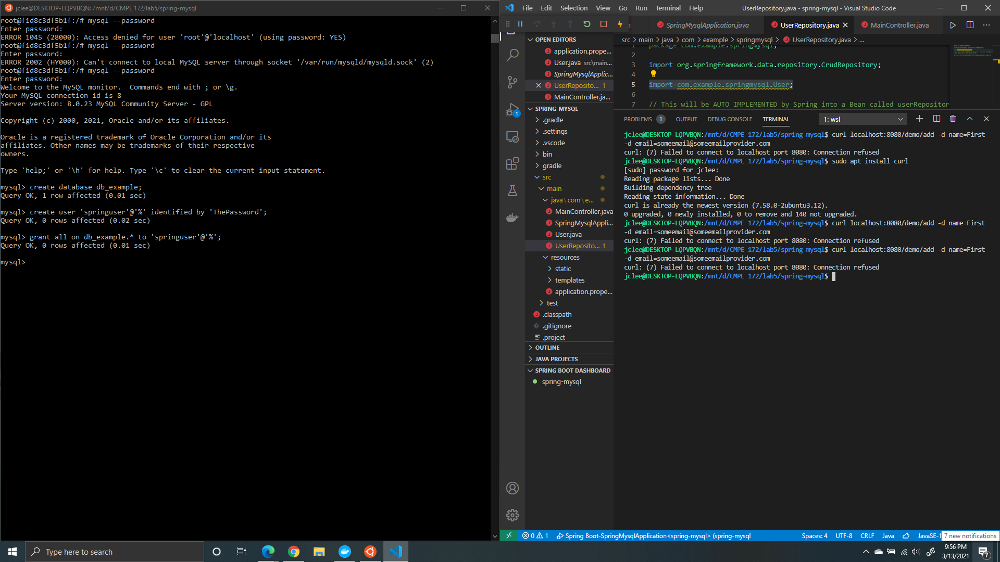

# SQL vs MongoDB
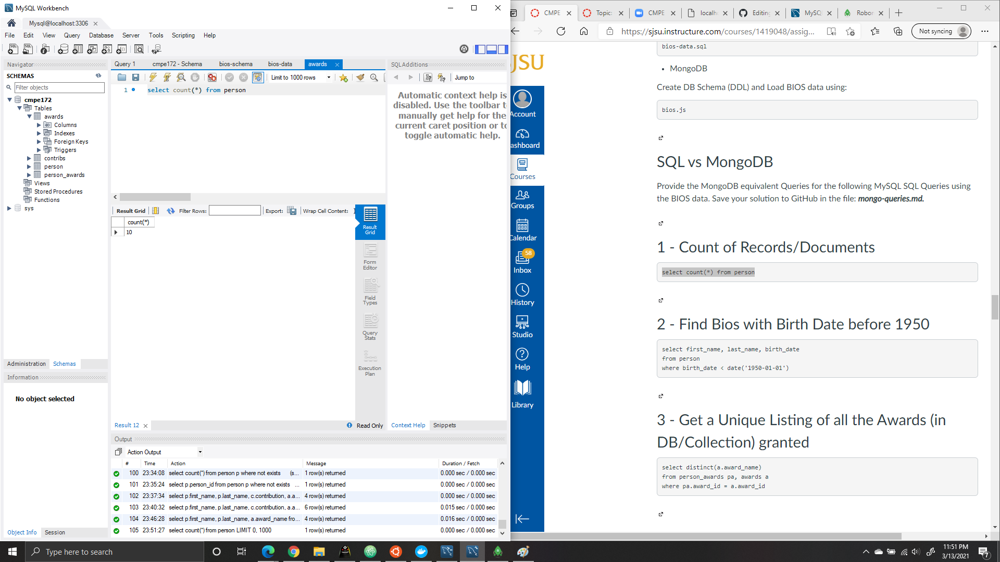
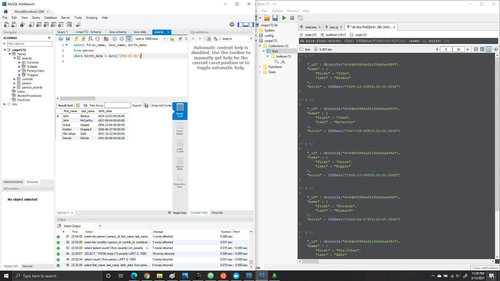
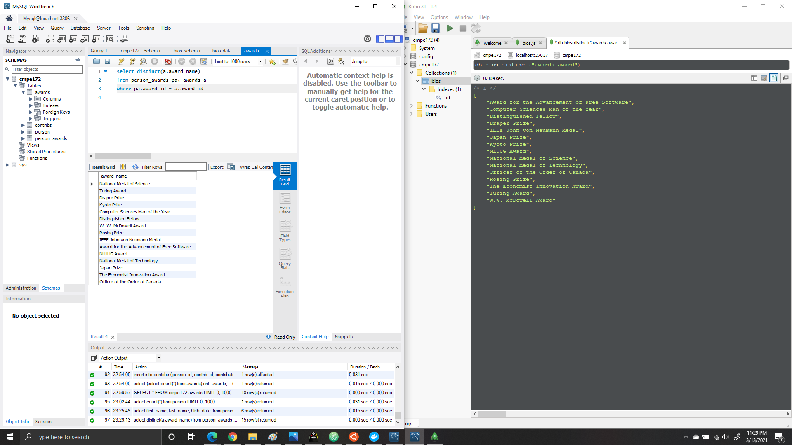
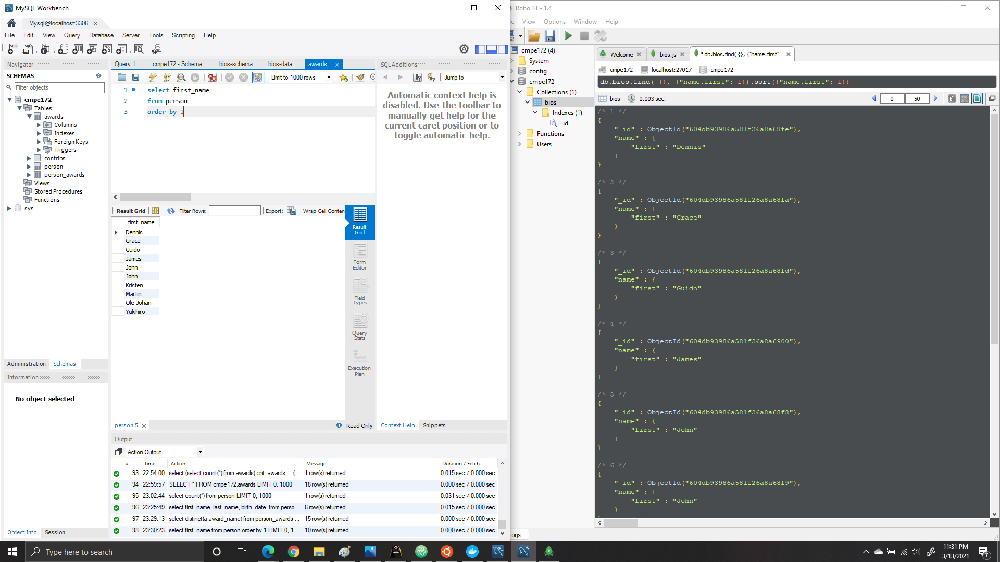

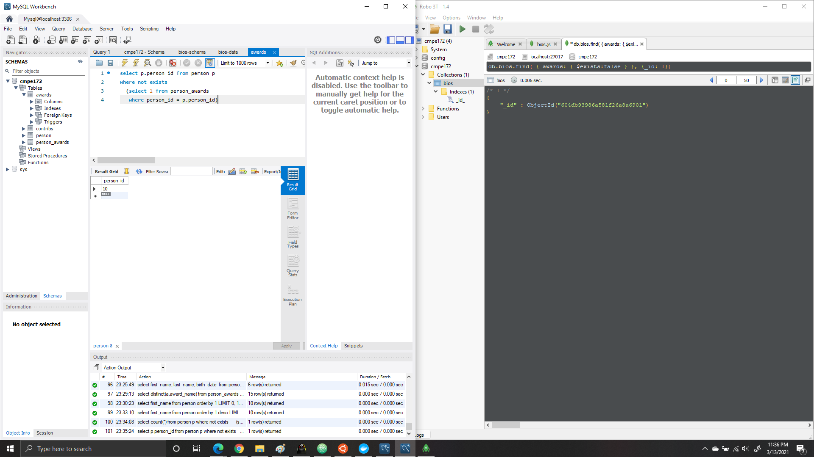
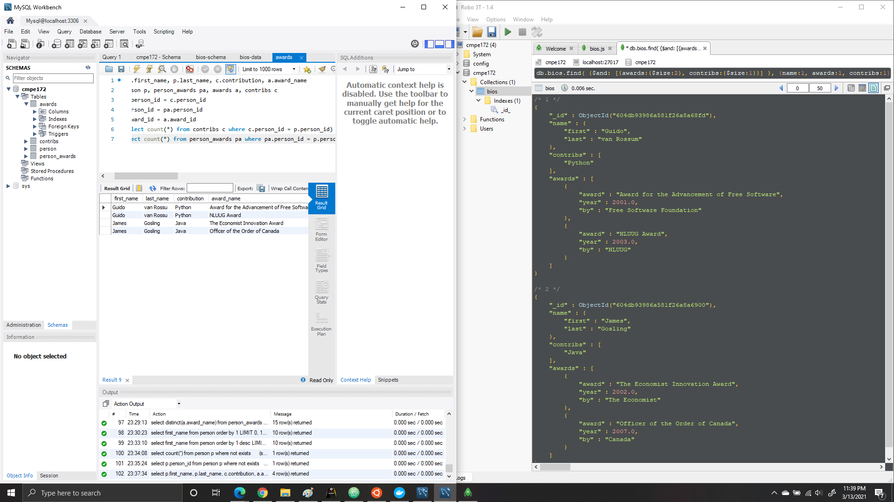
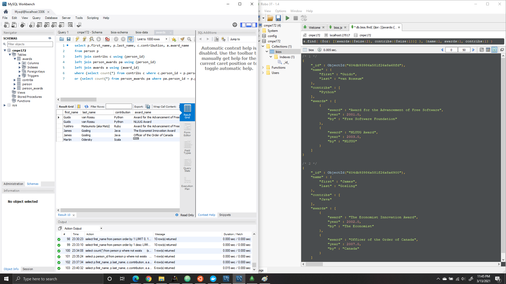
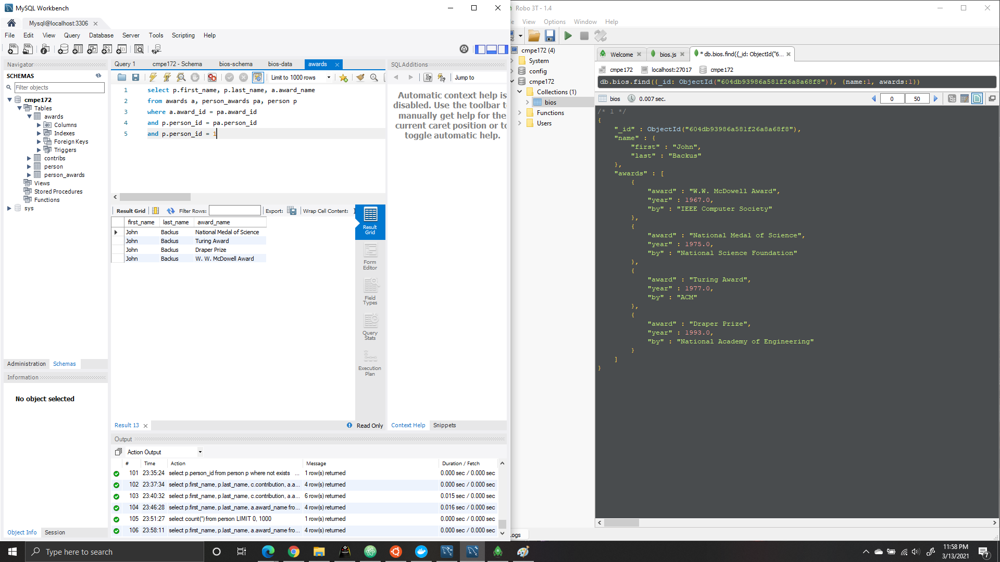

# Spring Gumball V3
In this lab, we copied Spring Gumball Version 2 over. We wanted to connect our Spring Gumball to MySQL. 

We edited the following files:
* application.properties
* gumball.html
* GumballModel.java
* GumballMachine.java
* UserRepository.java
* GumballMachineController.java

We did the following commands on Ubuntu:
* make docker-build
* docker network create --driver bridge gumball
* docker run-d --network gumball --name mysql -td -p 3306:3306 -e MYSQL_ROOT_PASSWORD-cmpe172 mysql:8.0

Afterwards, we would go into Docker Desktop and enter the mysql terminal and run the following commands:
* mysql -u root -p
* create database db_gb;

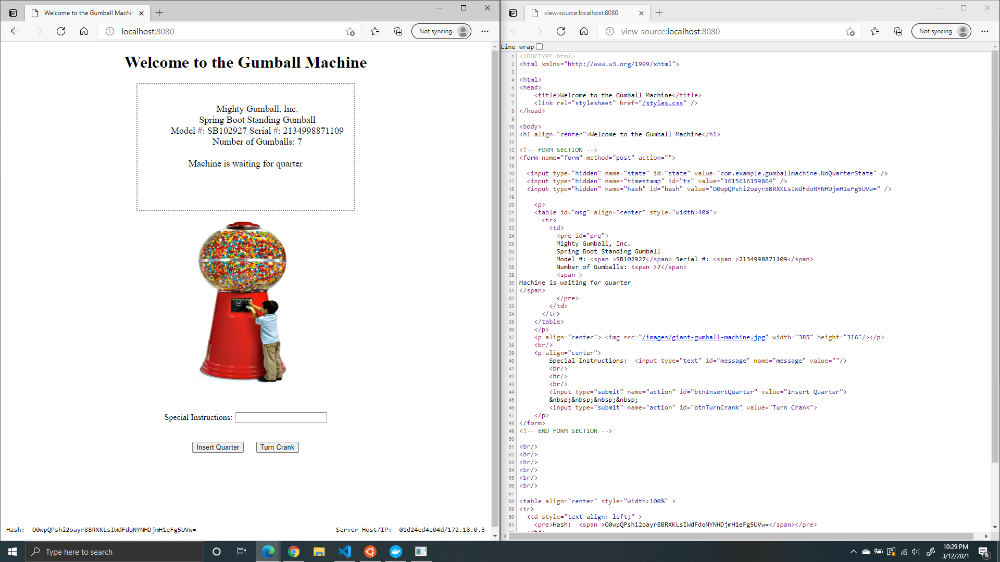

The following functions were ran in the mysql terminal to observer the table:
* use db_gb;
* show tables;
* select * from gumball_model;

