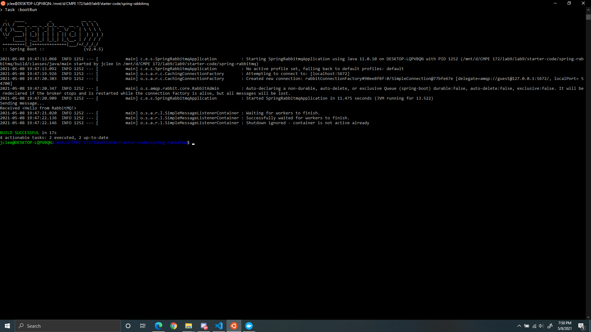
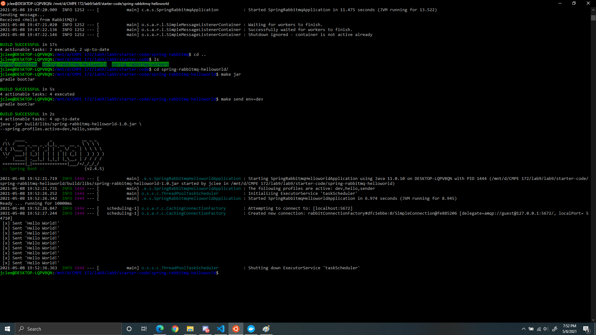
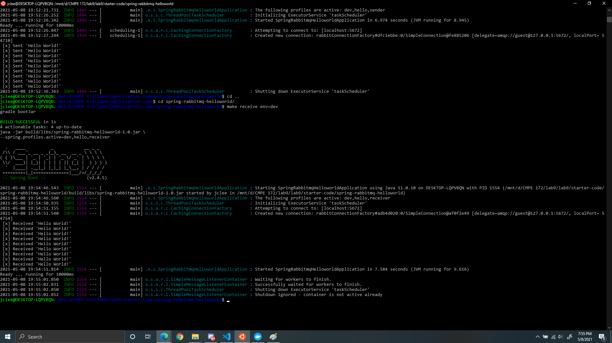
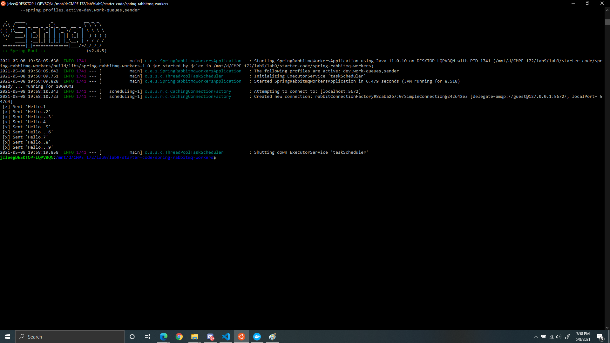
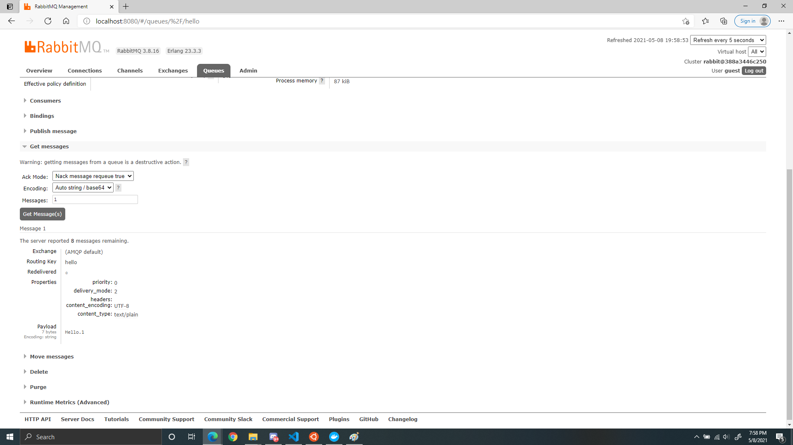
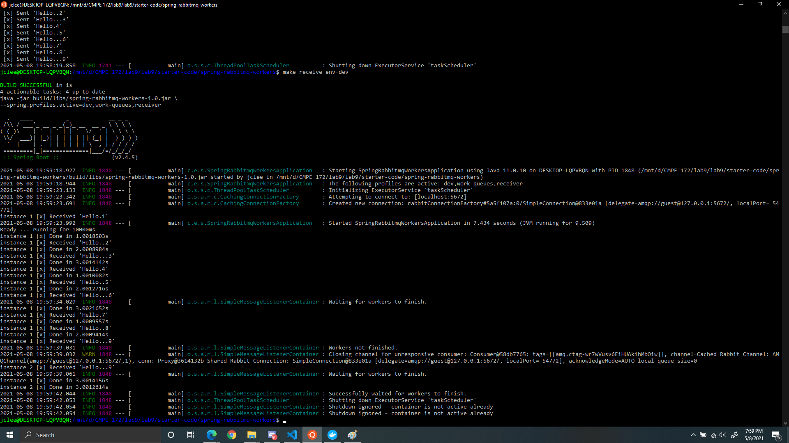

# CMPE 172 - Lab #9 - Spring RabbitMQ

# Discussion

A Spring Profile allows us to send messages as well as receive messages. We can use this feature in our project to have the customer send their order to the barista and have the barista accept the order. We can use RabbitMQ as an intermediate between the customer and the barista to send and receive messages. 

